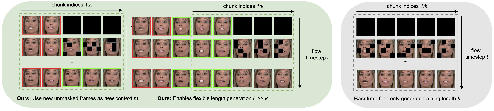

# MaskFlow: Discrete Flows for Flexible and Efficient Long Video Generation


This repository represents the official implementation of the paper titled "[MaskFlow: Discrete Flows for Flexible and Efficient Long Video Generation".

[](https://compvis.github.io/maskflow)
[](https://arxiv.org/abs/2502.11234)
[](https://www.apache.org/licenses/LICENSE-2.0)


Michael Fuest,
[Vincent Tao Hu](http://taohu.me),
[Björn Ommer](https://ommer-lab.com/people/ommer/)



## TLDR

MaskFlow is a chunkwise autoregressive approach to long video generation that uses frame-level masking and confidence-based heuristic sampling to produce seamless, high-quality video sequences efficiently. Instead of generating entire videos at once, MaskFlow generates overlapping chunks of frames, where each new chunk is conditioned on previously generated frames to ensure temporal consistency. During training, the model learns to reconstruct partially masked frames, making it naturally suited for extending video sequences while maintaining coherence. The frame-level masking strategy aligns perfectly with chunkwise generation, enabling the model to handle different levels of corruption while ensuring smooth transitions. To further speed up inference, we incorporate confidence-based heuristic sampling, selectively unmasking only the most confidently predicted tokens at each step. This approach allows MaskFlow to generate long videos with greater flexibility and efficiency than traditional methods..

## 🎓 Citation

Please cite our paper:

```bibtex
@InProceedings{fuest2025maskflow,
      title={MaskFlow: Discrete Flows for Flexible and Efficient Long Video Generation},
      author={Michael Fuest and Vincent Tao Hu and Björn Ommer},
      booktitle = {Arxiv},
      year={2025}
}
```

## :white_check_mark: Updates
* **` Mar. 4th, 2025`**: Training code released.
* **` Feb. 16th, 2025`**: Arxiv released.

## 📦 Training

#### FaceForensics


```bash
CUDA_VISIBLE_DEVICES=0,1,2,3 accelerate launch --num_processes 4 --num_machines 1 --multi_gpu --main_process_ip 127.0.0.1 --main_process_port 8868 train_acc_vq.py model=dlatte_xl2 compile=pre mixed_precision=fp16 dynamic.scheduling_matrix=full_sequence dynamic=maskflow dynamic.scheduler=sigmoid dynamic.time_cond=1 dynamic.mask_ce=1 input_tensor_type=btwh tokenizer=sd_vq_f8 data=ffs_indices data.sample_fid_every=50_000 data.batch_size=2 data.sample_fid_bs=1 data.sample_fid_n=10_0 data.sample_fid_every=400_000 data.sample_vis_n=1 data.sample_vis_every=50_000 data.num_workers_per_gpu=12 ckpt_every=200_000 data.train_steps=400_000 dynamic.reweigh_loss=snr dynamic.cum_snr_decay=0.8 dynamic.snr_clip=6.0 dynamic.use_fused_snr=1 dynamic.objective=pred_x0 dynamic.noise_level=random_all tokenizer.latent_size=32 dynamic.sampler=mgm dynamic.sampling_timesteps=20 dynamic.n_context_frames=2 dynamic.sampling_window_stride=12 dynamic.sampling_horizon=16 dynamic.sampling_timesteps=20
```

#### DMLab

```bash
CUDA_VISIBLE_DEVICES=0,1,2,3 accelerate launch --num_processes 4 --num_machines 1 --multi_gpu --main_process_ip 127.0.0.1 --main_process_port 8868 train_acc_vq.py model=dlatte_b2 compile=pre mixed_precision=fp16 dynamic.scheduling_matrix=full_sequence dynamic=maskflow dynamic.scheduler=sigmoid dynamic.time_cond=1 dynamic.mask_ce=1 input_tensor_type=btwh tokenizer=sd_vq_f8 data=dmlab_indices data.sample_fid_every=50_000 data.batch_size=3 data.sample_fid_bs=1 data.sample_fid_n=10_0 data.sample_fid_every=400_000 data.sample_vis_n=1 data.sample_vis_every=50_000 data.num_workers_per_gpu=12 ckpt_every=200_000 data.train_steps=400_000 dynamic.reweigh_loss=snr dynamic.cum_snr_decay=0.8 dynamic.snr_clip=6.0 dynamic.use_fused_snr=1 dynamic.objective=pred_x0 dynamic.noise_level=random_all tokenizer.latent_size=32 dynamic.sampler=mgm dynamic.sampling_timesteps=20 dynamic.n_context_frames=2 dynamic.sampling_window_stride=12 dynamic.sampling_horizon=16 dynamic.sampling_timesteps=20
```

## Evaluation 

#### FaceForensics 

```bash 
TODO
```

#### DMLab

```bash 
TODO
```

## Weights

TODO

## Dataset Preparation

TODO

## 🎫 License

This work is licensed under the Apache License, Version 2.0 (as defined in the [LICENSE](LICENSE.txt)).

By downloading and using the code and model you agree to the terms in the  [LICENSE](LICENSE.txt).

[](https://www.apache.org/licenses/LICENSE-2.0)


